# Encrypt traffic between resources protected by Enforcers.

When you have a server processing unit or multiple server  processing units deployed behind a TCP/TLS terminating Load Balancer or K8s service, you need to explicitly configure this Load Balancer/Service, in for order for  client processing unit can have the appropriate path to reach out to the servers. 
This also works when you have a direct PU to PU flows. 
 
On top of this, if you want to enable mTLS encryption between the workloads, you can do  it using TCP Services (if both server and client are not doing TLS, encryption is automatically enabled). 

### Use Cases

### 1) Client communicates with a Server that is behind a K8s service

**I**n this scenario, both processing units are pods in a k8s cluster, deployed in the same k8s namespace. The client PU reaches out to the Server PU through a K8s service. 

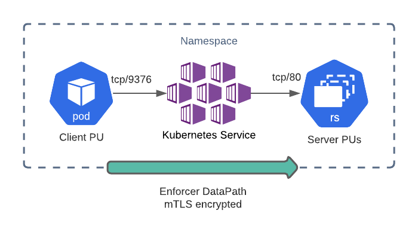

From a networking perspective, the client reaches out to the server that is exposed via a K8s Service using a ClusterIP, as shown in the image above. As such, the client will reach out to the service and then be redirected to any server pod attached to this service.

The K8s service is exposed on TCP port 9376 and the server pods are listening on TCP port 80. 
 
From a configuration perspective, we need to tell the client Enforcers how to reach the server Enforcers as they are not aware of the K8s Service in the path.

**Configuration steps:Kubernetes service configuration example: 
 
**The K8s Service configuration is shown below: 
 
The K8s service is exposed over tcp/9376 and is redirecting traffic to the pods attached to this service over the target port tcp/80 

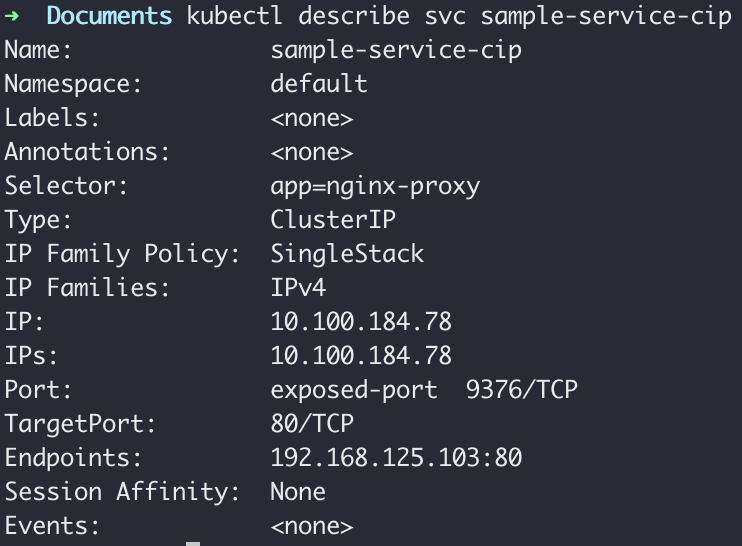

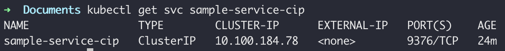

Now, let's review the TCP Services configuration on the microsegmentation console.

 
The  first step is to define the K8s Service. Go to Defend > Services > TCP Services and create a new TCP service 
 
 - Add the service name (or IP) and port.

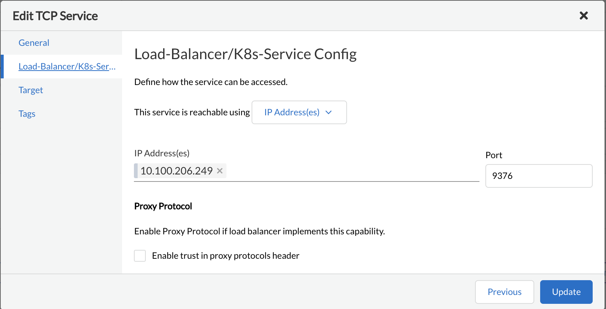

 The next step is to define the target. The target is the pod that is connected to this service and protected by an Enforcer. 
 
 -  Under Processing Unit Selector, add the respective metadata the matches your target processing unit(s), such as `$identity=processingunit` and `$name=<image name>`

 
- Under port, add the port that your pod is listening on (target port)

 
- TLS only, (enable it in case the client is not sending TLS traffic but the server expects it). This will instruct the Enforcers to encrypt the flow end-to-end.

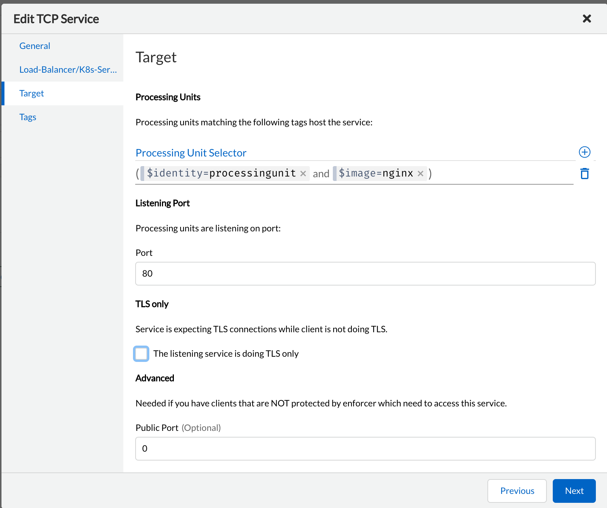

Save your configuration. 
 
Now, we need to create a ruleset that will authorize this communication.

Go to Rulesets and add a new one to allow the necessary traffic (the image below presents an example of a ruleset that allows the traffic between client and server).

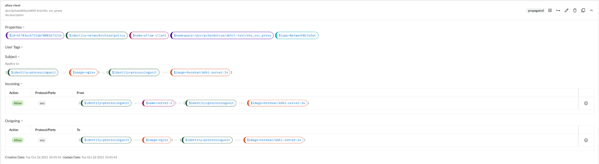
 

**Results** 
 
As we can see now, the client is able to reach out to the Server through a K8s service.  
 
The first image displays the successful encrypted connection between the client and the server (the locker icon in the flow identifies that the Enforcers are encrypting the flow).

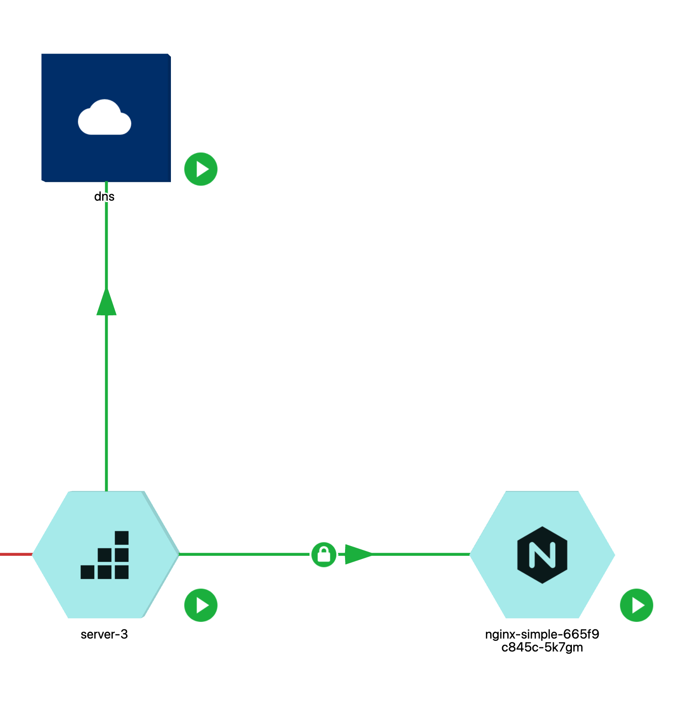

 While the second image below, shows the connection being established from the client PU perspective.

 
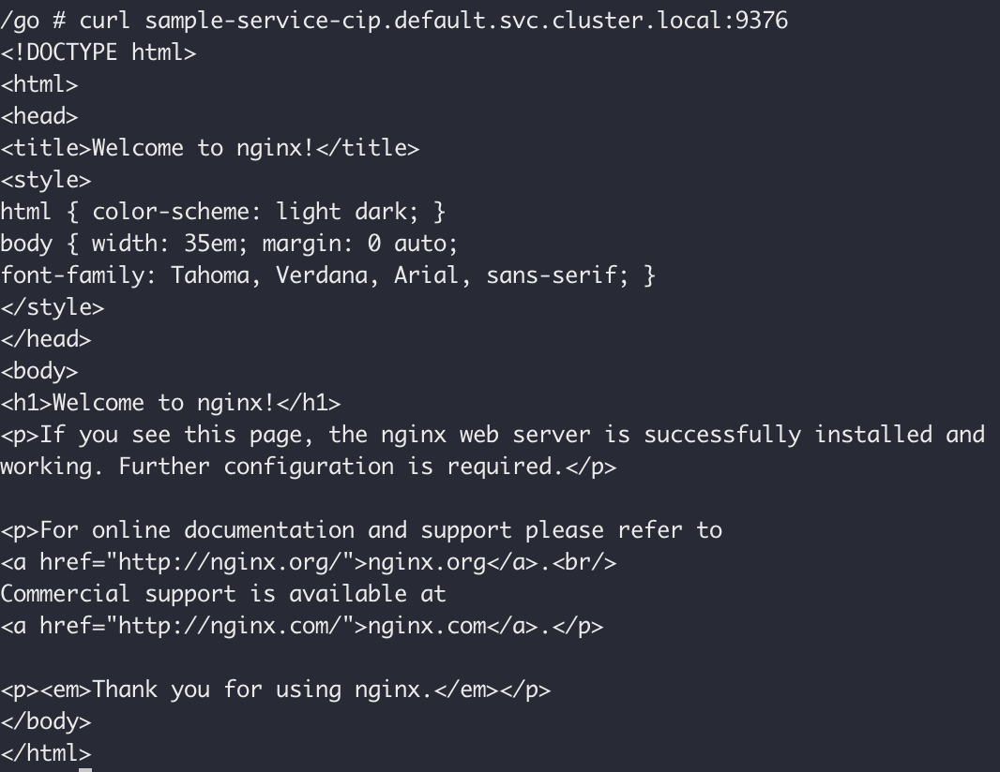

###  2) Client communicates with a Server that is behind a TCP Terminating Load  Balancer

In this use case, the client is a Host Processing Unit and the Server is a Container PU deployed on a K8s cluster and exposed via a Network Load Balancer. Both PUs are in different microsegmentation namespaces. 

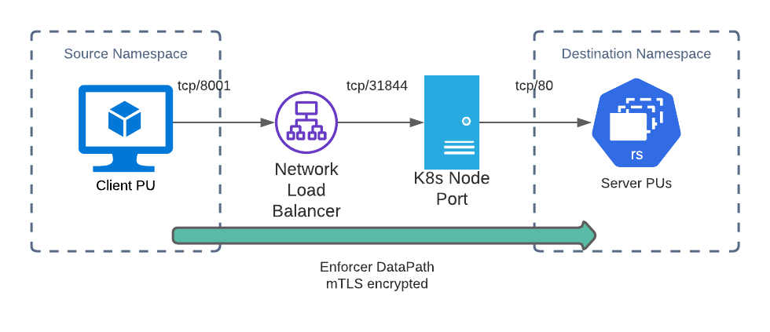
 

From a networking perspective, the client connects to the NLB via TCP over port 8001. The NLB redirects the traffic to its configured target (K8s Node Port) listening on TCP port 31844 and the Node Port is then mapped to the server pod that is listening on port TCP 80.

**Configuration steps** 

Let's start by reviewing the configuration of the Load Balancer 
 
The Network Load Balancer is configured to listen for connections on TCP/8001 and it redirects traffic to the K8s NodePort listening on TCP port 31844 and the Server PUs are connected to the NodePort over port 80.

As we can see in the image below, the Load Balancer is listening for TCP connections in the port 8001

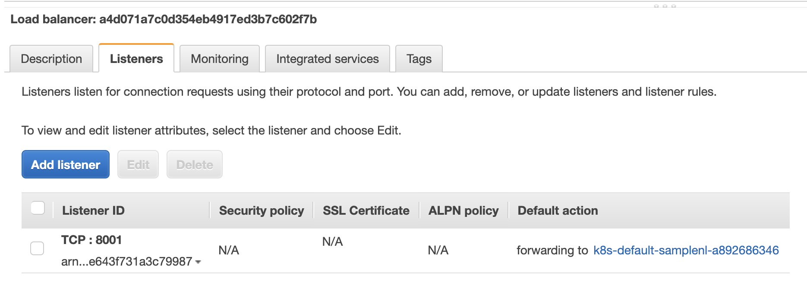

And it forwards the requests to the targets (K8s Node Port) that are listening for TCP connections on port 31844  

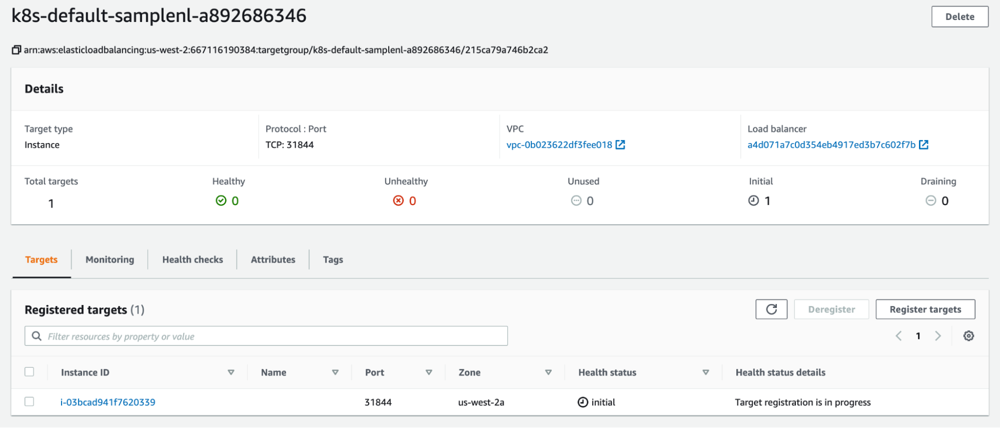
 

Now, let's review the TCP Services configuration on the microsegmentation side. 
 
The  first step is to define the LB Service. 

 
Go to Defend > Services > TCP Services and create a new TCP service 
 
 - On Load Balancer Config, add your Load Balancer FQDN or IP address and port 

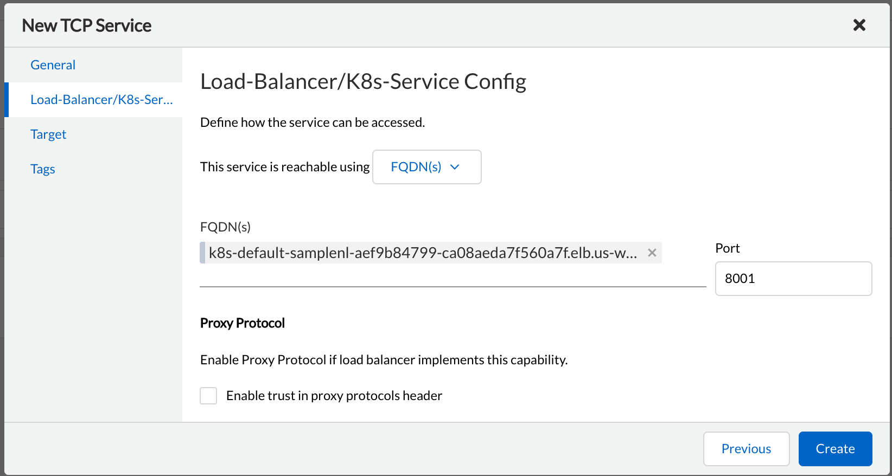

Under the targeting processing unit tab, add all the required selectors that will match your server PU (in this case, the image name) and the port that the pod is listening to.

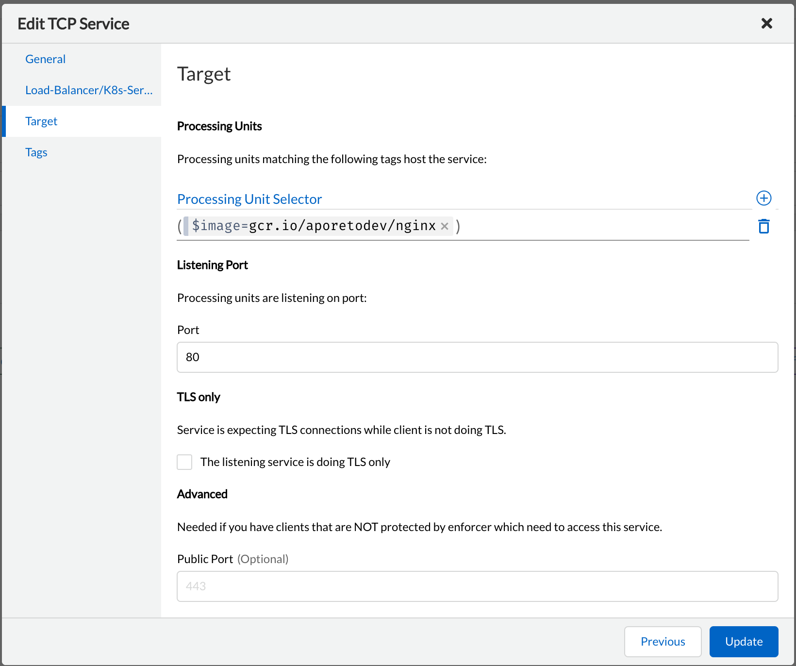

After the TCP service is  configured, we need to create a mapping that allows client PUs from different Microsegmentation namespaces to access the service. To achieve this, we need to create a Service Dependency Map. 
 
A Service Dependency map creates an attachment for all PUs that needs to have visibility of a given TCP Service. For every new @group or @k8s namespace created, a default service dependency policy is automatically created, which provides access for all PUs to all services in that namespace. If there is a need to narrow down targets or to expose the TCP Service to a different microsegmentation namespace, disable the default policy and create a custom SDP  by following the steps below.

Go to Defend -> Services -> Service Dependencies Policies

Click on + [Service Dependency Policy] and Provide a name for the Policy and enable Propagation if the client PU is in the child namespace. 

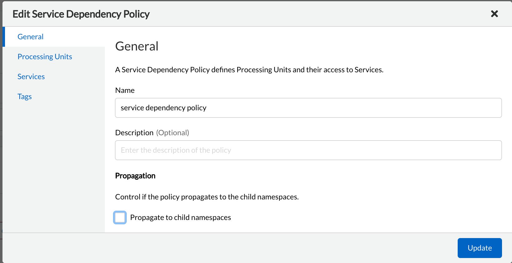

On Processing Units, provide one or multiple tags that apply to the Client PU. 

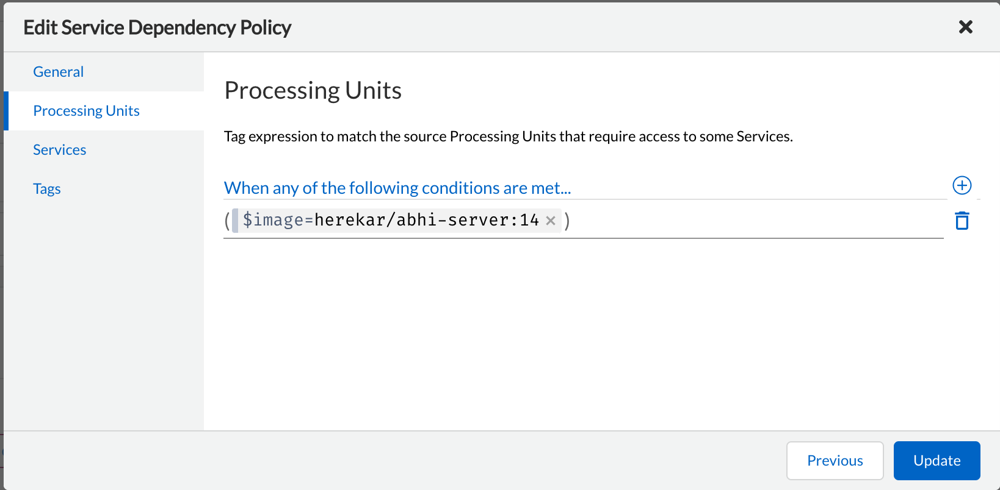

On Services, provide one or multiple tags that apply to the TCP Service. 

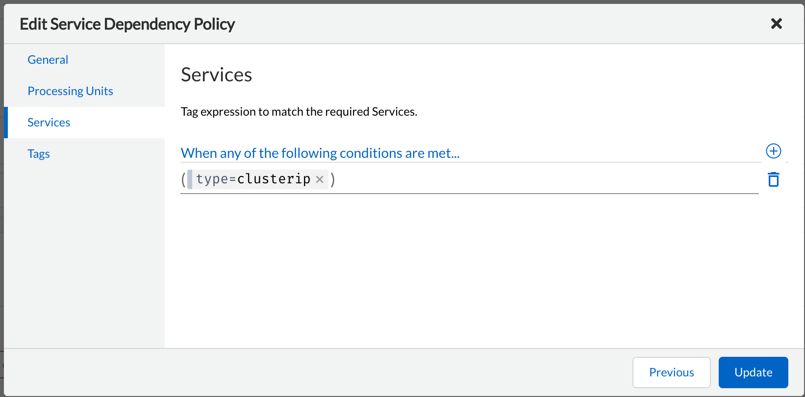

Finally, we need to create the proper rulesets that will authorize this communication.

Go to Rulesets and add the rulesets in the required namespaces (the image below presents an example of a ruleset that allows the traffic from the PUs in the example above).

 
 
**Results**

As we can see now, the client is able to reach out to the Server through a K8s service.  
 
The first image displays the successful encrypted connection between the client and the server (the locker icon in the flow).

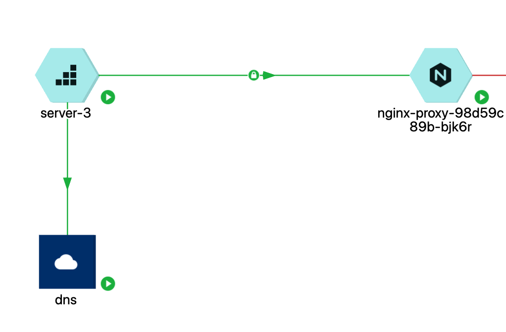

 While the second image below, shows the connection being established from the client PU perspective.

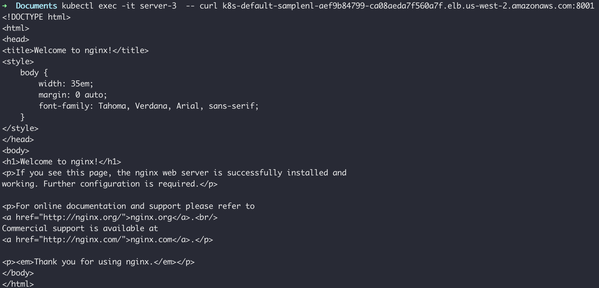

The below image shows the flow logs in which source IP of the external client is preserved and reported using proxy protocol

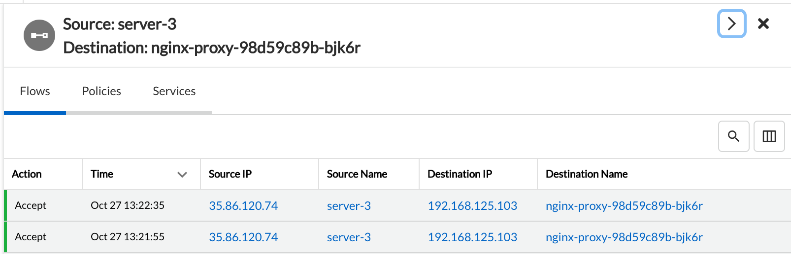

 
### 3) External Network communicates with a Server that is behind a Load Balancer

In this use case, the client is an External Network  and the Server is a Container PU deployed on a K8s cluster and exposed via a Network Load Balancer. 

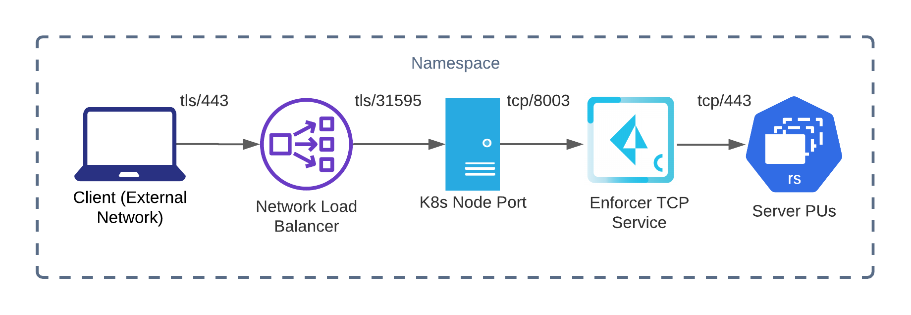

From a networking perspective, the client connects to the NLB via TLS over port tls/443. The NLB redirects the traffic towards the k8S NodePort over tls/31595. This NodePort is connected to the Enforcer service port over tcp/8003 (as we don't have a PU to PU traffic and encryption is a requirement on the server side). The Enforcer is connected to the server processing units over tcp/443

 
**Configuration Steps:**

**Kubernetes service configuration example:**

The K8s Service configuration is shown below. 
 
As we can see in the images below, the Load Balancer is listening for TLS  connections in the port 443 and redirecting the traffic to the K8s Service 

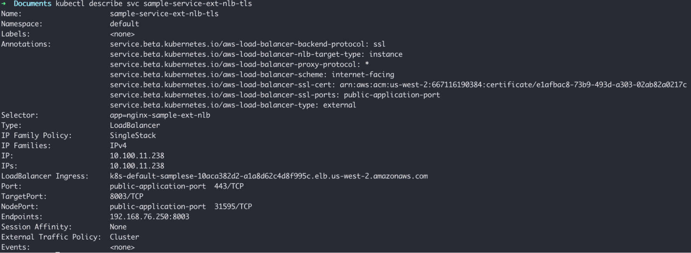

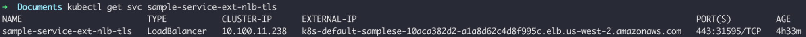

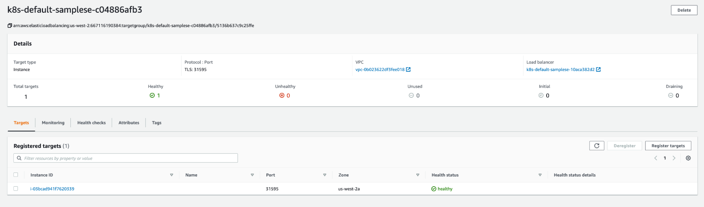

The K8s forwards the requests to its target (K8s Node Port) that are listening for TLS connections on port 31595

Now, let's review the TCP Services configuration on the microsegmentation side. 
 
The  first step is to define the LB Service. 

 
Go to Defend > Services > TCP Services and create a new TCP service 
 - On Load Balancer Config, add your Load Balancer FQDN or IP address and port

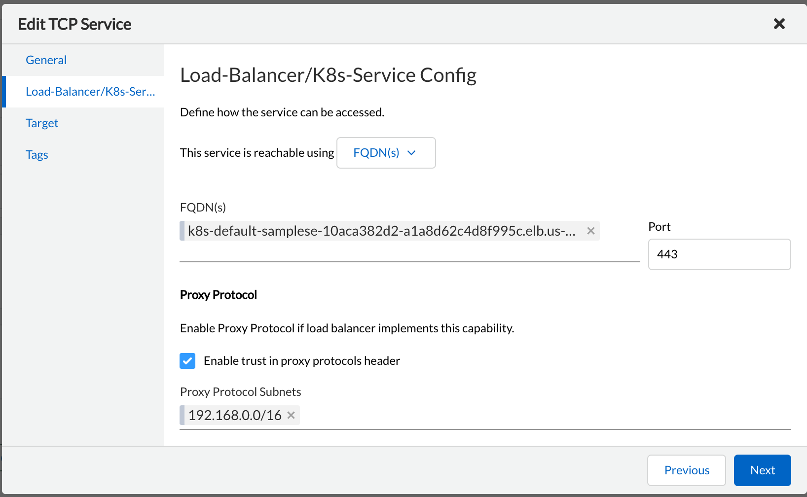

**NOTE**: _If you are using Proxy Protocol, remember to enable it during the setup and add the LB subnet as required._ 
_The Proxy Protocol is  designed to chain proxies / reverse-proxies without losing the client information._

_A proxy will use its own IP stack to get connected on remote servers. Because of this, the server may lose the initial TCP connection information like source and destination IP and port when a proxy is involved and proxy protocol aims to solve this problem. 
Additional details can be found [here](https://docs.aws.amazon.com/elasticloadbalancing/latest/classic/enable-proxy-protocol.html)_

Under the targeting processing unit tab, add all the required selectors that will match your server PU (in this case, the image name) and the port that the pod is listening to (in this case ssl/443). Provide a public port, which is used to access the Enforcer TCP service by External Clients. After giving a public port, there are three TLS modes to choose - 

1. Microsegmentation Public Signing CA: TLS is provided by the Enforcer TCP service, use this option if Server PU is handling TCP connections and expect secure and encrypted communication. Microsegmentation internal public signing CA will issue you a server certificate. (For an end to end TLS communication and SSL offloading, Load balancer can be configured to listen on TLS and forward on TLS, which in the end will be terminated by the Enforcer TCP service) 

2. Custom Certificate: TLS is provided by the enforcer TCP service, use this option if Server PU is handling TCP connections and expect secure and encrypted communication. Provide your own set of Certificate and Key. (For an end to end TLS communication and SSL offloading, Load balancer can be configured to listen on TLS and forward on TLS, which in the end will be terminated by Enforcer TCP service) 

3. No TLS: TLS is not provided by the enforcer TCP service, use this option if Load balancer is listening on TLS, forwarding to backend on TCP/TLS and/or Server PU is handling TLS connections.

     
The Below image shows a no TLS configuration

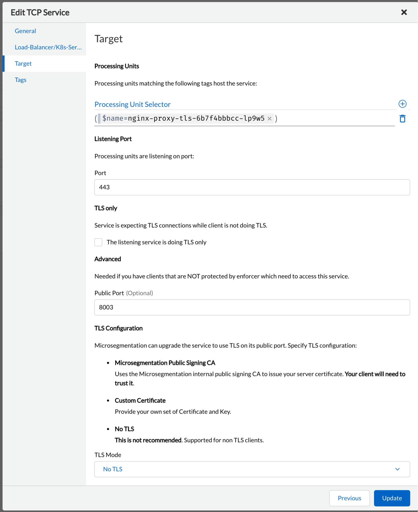

The Below image shows a TLS (custom certificate) configuration

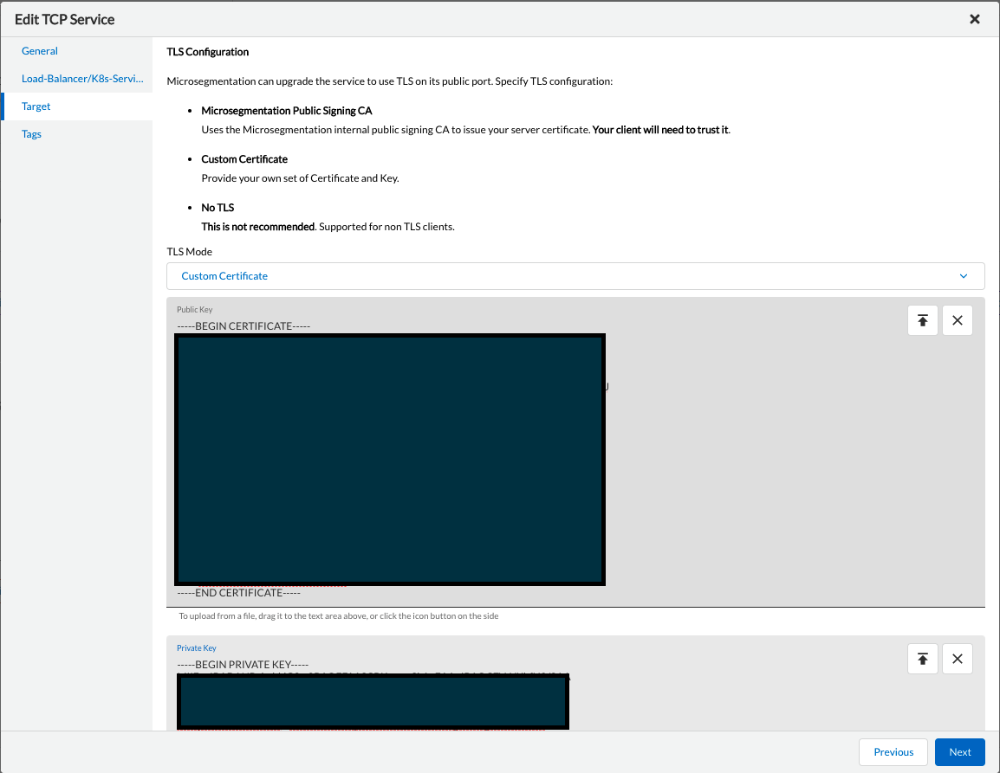

Finally, we need to create the proper rulesets that will authorize this communication.

Go to Rulesets and add them in the required namespaces (the image below presents an example of a ruleset that allows the traffic from the PUs in the example above).

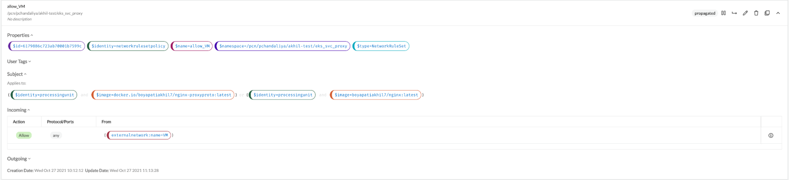

**Results**

As we can see now, the client is able to reach out to the Server through a K8s service. 

The first image displays the successful connection between the external client and the server with no TLS configuration.

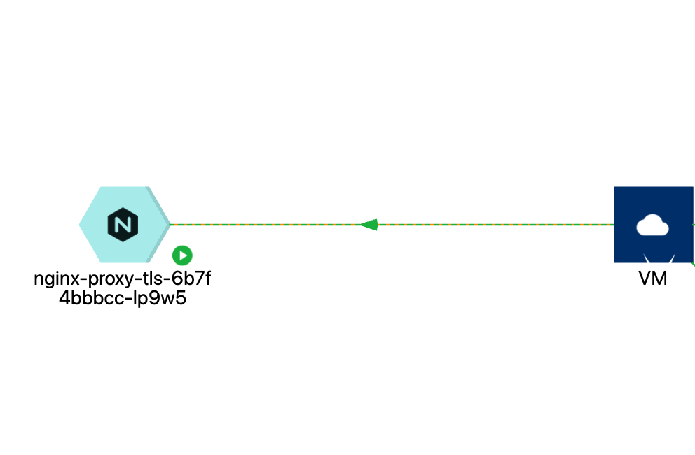

The second  image displays the successful encrypted connection between the external client and the server with TLS configuration (custom certificate).  

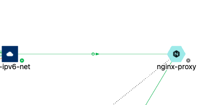

While the third image below, shows the connection being established from the external client perspective.

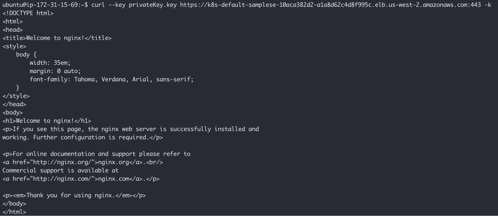

The below image shows the flow logs in which source IP of the external client is preserved and reported using proxy protocol.

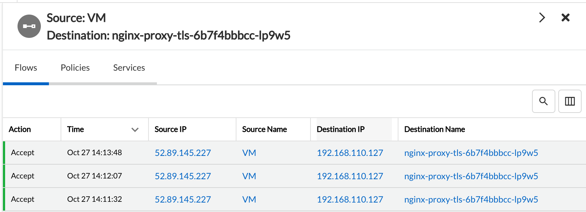

**Additional configurations and exceptions:**

* In a non-Kubernetes environment, while creating a target group for load balancer, remember to disable the "Preserve client IP addresses" option when proxy protocol is being used, as shown in the below picture.

    
   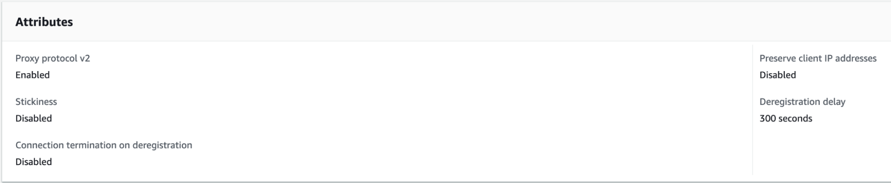

   **Note:** _When TCP services are used, we recommend enabling ipv6 on the Enforcer, because all traffic is intercepted by the Enforcer in this mode (ipv6 is disabled by default)._